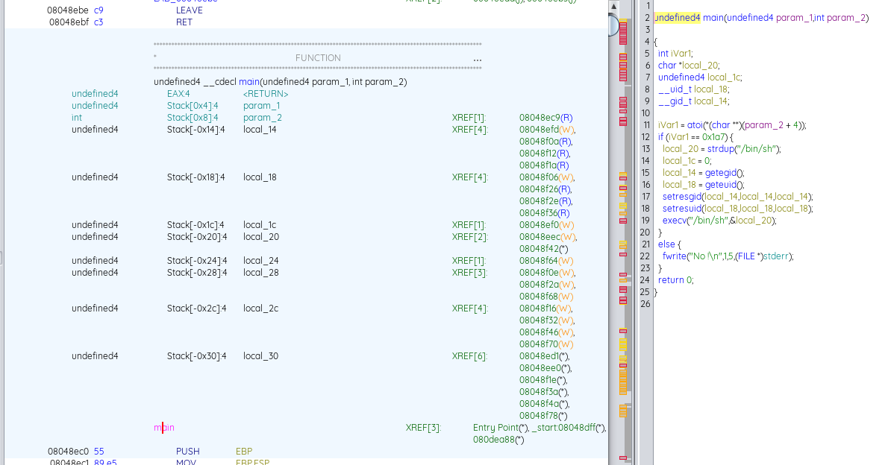

# Walkthrough 

 1. After connected to level00
Copy the executable to host machine with follow command line `scp -P 4242 level0@192.168.56.104:/home/user/level0/level0 .` 
 
2. Make reverse engineering with Githdra  

3. Analyse the programme
This program  checking if an integer value from the command line is equal to 0x1a7 (423 in decimal). 
If the condition is met, it allocates memory for the string "/bin/sh," sets user and group IDs, and then executes the shell. 
 Otherwise, it prints "No !" to the standard error stream

4. How to find the password:
When give to the program `423` as argument it launch a shell with  rights to display the file `.pass` 
`cat /home/user/level1/.pass` output : `1fe8a524fa4bec01ca4ea2a869af2a02260d4a7d5fe7e7c24d8617e6dca12d3a`
