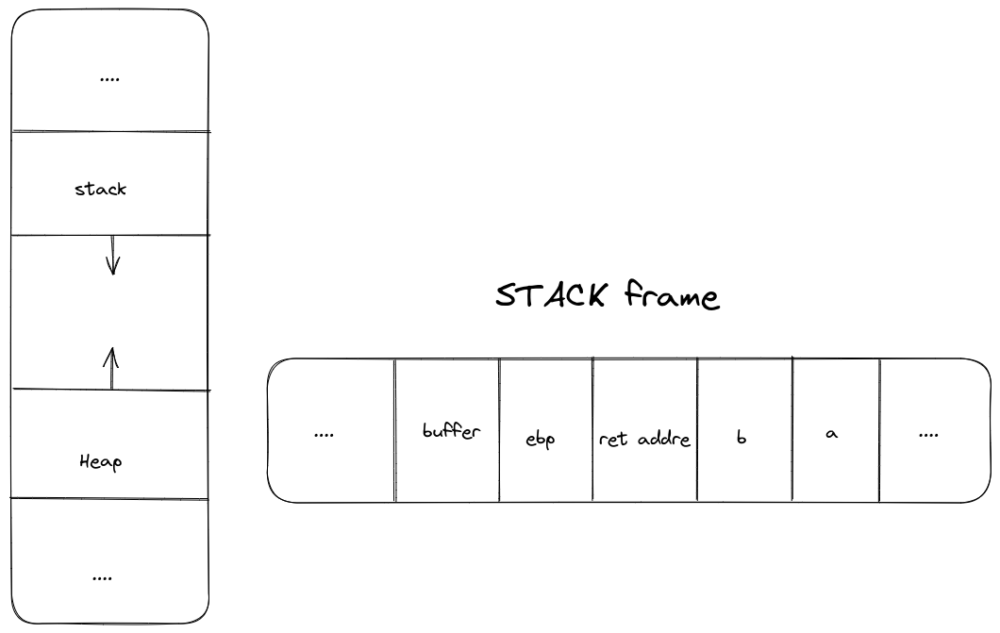
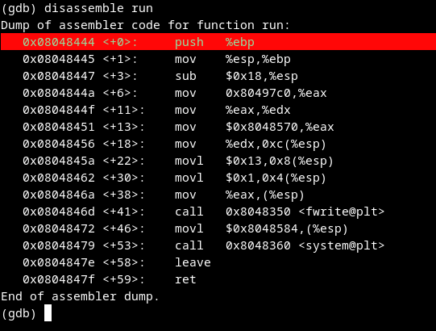
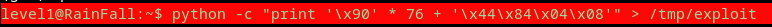
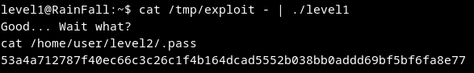

# Walkthrough
 1. After analyse the source program, the goal is to make buffer overflow to launch a shell pogram
 2. the idea is to blow the buffer in the `main` after jump to the `run` function
 
**Run function**
 
> Address of the `run()` function 0x08048444
 
 3. Make a script that will explode the buffer then jump into the run function

> the address Address of the `run()` function has been  reversed 0x08048444

 4. Give script to the program as argument into stdin throught a pipe 

