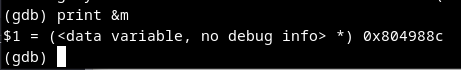
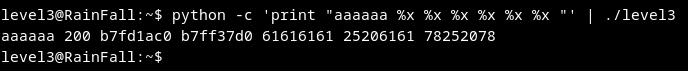
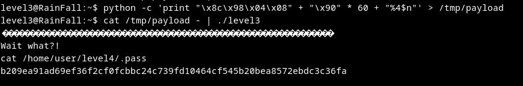

# Walkthrough

> **The Goal:** manipulate `printf()` function to changing the value of the variable `m` at the address 0x804988c 

1. ## Fnd the position of a buffer on the stack using the printf
use the %x format string vulnerability to print memory address on the stack 
I give printf the follow string `aaaaaa %x %x %x %x %x %x` the %x it telling to printf to print memory content
Buffer content `aaaaaa` is at the 4th position `61616161`.

2. ## Modify `m` value s 
The modifier %n will write the number of bytes specified in the choosen address.
The command `python -c 'print "\x8c\x95\x08\x08" + "\x90" * 60 + "%4$n"' > /tmp/payload`  
creates a format string attack that aims to modify a variable using the %n  
The `%4$n` specifier tells printf to treat the argument at the  4th position as an address to write the number of characters printed 

3. Load Payload 

 Password:`b209ea91ad69ef36f2cf0fcbbc24c739fd10464cf545b20bea8572ebdc3c36fa`
